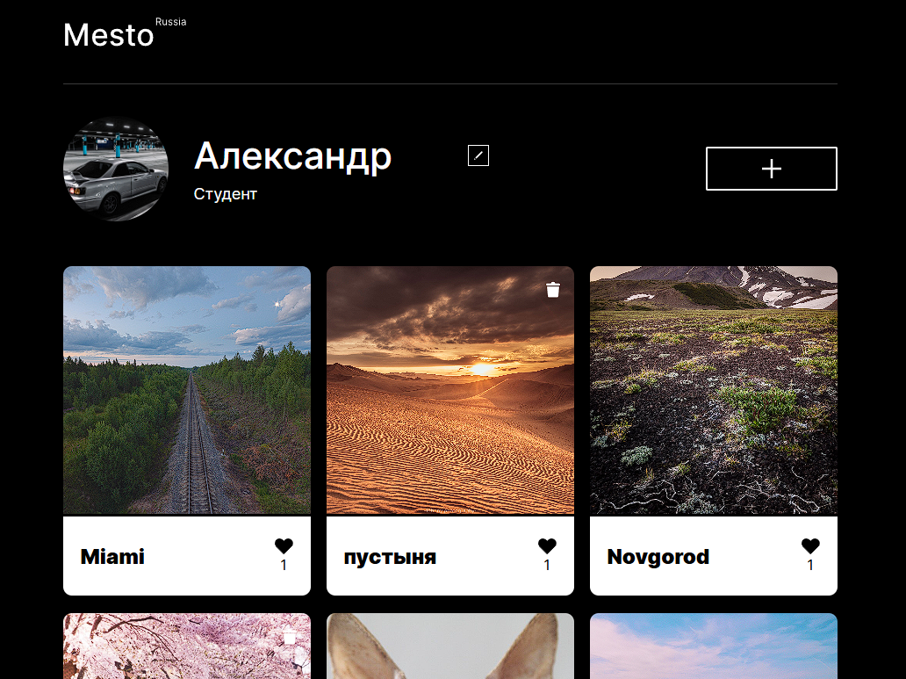

# Проектная работа Mesto

<u>https://milsb4.github.io/mesto-project-ff/</u>

##Добро пожаловать в Mesto

***(RU)***В наш век цифровых технологий и стремительного развития социальных сетей, фотография
 стала неотъемлемой частью повседневной жизни. С каждым днем всё больше людей стремится 
 делиться своими моментами, идеями и творчеством через визуальные образы. В ответ на эту 
 потребность мы представляем проект создания уникального веб-сайта, который станет платформой 
 для обмена фотографиями и взаимодействия между любителями фотографии и профессионалами.
--------------------
***(EN)***In our age of digital technology and the rapid development of social networks, photography 
has become an integral part of everyday life. More and more people are striving to share 
their moments, ideas, and creativity through visual imagery. In response to this need, 
we present a project to create a unique website that will serve as a platform for sharing 
photographs and facilitating interaction between photography enthusiasts and professionals.
----------------------

> Главное меню